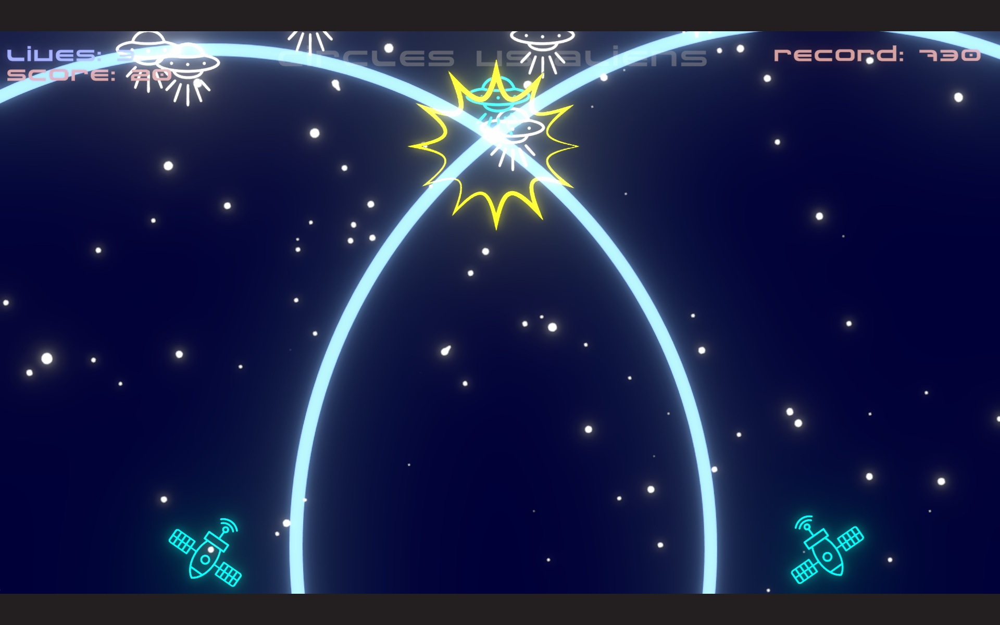
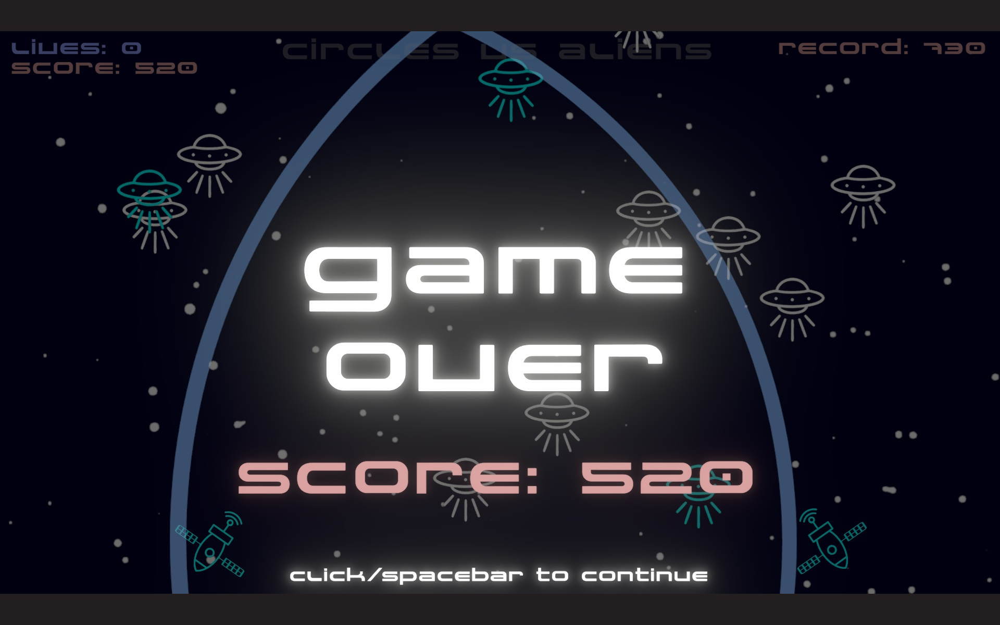

# Circles vs Aliens

**Circles vs Aliens** is a wave-interference arcade game created for **GitHub Game Off 2025**.  
Theme of the jam: **WAVE**.

Aliens are descending.  
Your antennas emit expanding energy circles.  
Where waves intersect, you can trigger powerful explosions — timing is everything.

Master resonance, chain reactions, and survive as long as possible.

---

## 🎮 How to Play

**←** — Emit wave from left antenna  
**→** — Emit wave from right antenna  
**↓** — Trigger explosions at all wave intersections  

- Max **2 waves per antenna**  
- Some aliens **emit extra waves when destroyed**  
- If an alien reaches the bottom, you **lose a life**

---

## ⭐ Features

- Dynamic **wave interference** system  
- **Additive glow** and URP **bloom**  
- **Camera shake** and **flash effect**  
- Multiple simultaneous explosion points  
- Increasing difficulty  
- **High score** saved via PlayerPrefs  
- Fixed **16:9** aspect ratio with letterboxing  
- Minimal UI, title screen & game over screen

---

## 📸 Screenshots

### Title Screen

### Gameplay

### Game Over

---

## 🕹️ Play the Game

Download the Windows build from itch.io:  
👉 *[insert your itch.io link here]*

Extract the `.zip` and run `CirclesVsAliens.exe`.

---

## 🛠 Built With

- **Unity 6.13** (URP)
- C#
- New Input System
- TextMeshPro
- PlayerPrefs

---

## 👤 Credits

Game design, code, art & sound: **Giovanni Civati**  
Created for **GitHub Game Off 2025**.

---

## ⚖️ License

This project is released under the **MIT License** (see LICENSE file).  
All visual and audio assets are original or jam-safe licensed.

---

## 🎧 Asset Credits

**Images / Backgrounds**  
Generated with **Gemini** and lightly edited by me (Giovanni Civati).

**Music**  
Generated with **Stable Audio** (Stability AI).

**Sound Effects**  
Taken from **Freesound.org** (CC0 where applicable).

**Code**  
Written by Giovanni Civati with AI assistance (ChatGPT).

